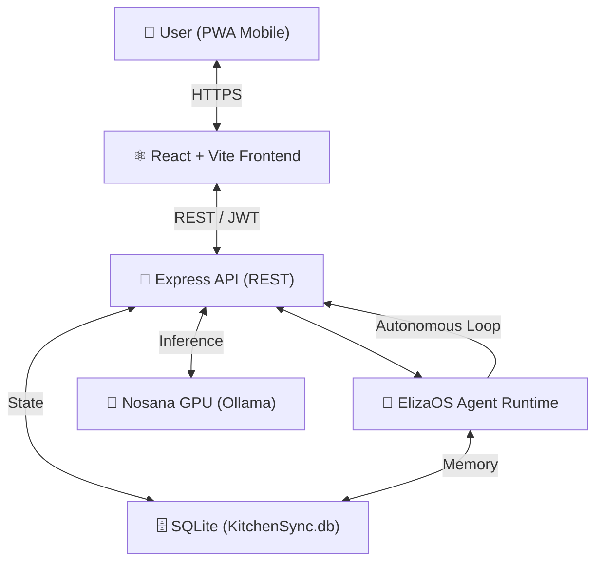

# 🍽️ KitchenCopilot — Autonomous AI Kitchen Manager

> **KitchenCopilot** is an autonomous AI agent built on **ElizaOS**, designed to revolutionize household food management. It leverages advanced computer vision to "see" your ingredients and uses autonomous reasoning to plan meals, manage budgets, and reduce waste.

---

## 🏗️ System Architecture

KitchenCopilot uses a hybrid architecture combining a high-performance **Express REST API** for real-time frontend interactions and an **ElizaOS Agent Runtime** for autonomous background tasks and complex LLM reasoning.

### High-Level Architecture

### Key Components
1.  **Frontend (React/Vite)**: A mobile-first, zero-refresh PWA with native camera integration and Web Speech API for voice control.
2.  **Backend (Express + ElizaOS)**: Handles authentication, image orchestration, and complex kitchen logic (plugin-kitchen).
3.  **Vision Pipeline (Nosana/Ollama)**: Uses decentralized GPU compute to run `llama3.2-vision:latest` for real-time ingredient extraction from photos.
4.  **Database (SQLite)**: A unified storage layer (`kitchensync.db`) managing users, inventory sections (Fridge, Pantry, etc.), recipes, and sessions.

---

## 🚀 How It Works

### 1. Vision-Based Ingestion
When you take a photo of your fridge:
-   The image is sent to the backend as a Base64 stream.
-   The **Vision Service** sends it to a **Nosana GPU node** running Ollama.
-   The AI extracts specific ingredients, quantities, and assigns metadata (emojis, estimated expiry).
-   **Review Modal**: You get to review the items and choose exactly where they belong (e.g., "Add to Pantry" or "Wipe and replace Fridge").

### 2. Autonomous Reasoning
KitchenCopilot doesn't just wait for you. It features a **24-hour Replanning Scheduler** that runs in the background:
-   It analyzes expiring items every day.
-   It regenerates a **Weekly Meal Plan** optimized to use soon-to-expire food first.
-   It automatically updates your **Shopping List** based on missing essentials for your planned recipes.

### 3. Voice Command Center
Equipped with a custom **Intent Router**, you can speak naturally to the app:
-   *"Add milk to my pantry"*
-   *"What can I cook with these eggs?"*
-   *"I just finished the carrots"*
-   The agent parses the intent and updates the database via internal API calls.

---

## 🛠️ Tech Stack

-   **Agent Framework**: ElizaOS (v1.4.4+)
-   **Backend**: Node.js, Express, better-sqlite3, JWT
-   **Frontend**: React, Vite, PWA, Tailwind CSS
-   **AI Inference**: Nosana GPU (Decentralized Ollama)
-   **Voice**: Web Speech API (Browser-native)
-   **Deployment**: Docker Compose, Nginx, Certbot

---

## 📍 Important Features

-   **Multi-Inventory Support**: Group your items by physical location (Fridge, Pantry, etc.).
-   **Expiration Tracking**: Intelligent estimation and visual urgency indicators (Lightning bolt ⚡ for urgent).
-   **Budget Mapping**: Set a weekly budget and let the AI plan meals that fit.
-   **PWA Ready**: Install it on your iOS/Android home screen for a native app experience.

---

## 🔮 Future Improvement Plans

1.  **Multi-User Households**: Shared family inventories and collaborative shopping lists with real-time sync via WebSockets.
2.  **External Grocery Integration**: Direct API connections to grocery delivery services (Instacart/UberEats) to populate your cart automatically from the Shopping List.
3.  **Barcode Scanning Support**: Fallback for pre-packaged items that vision might struggle with for 100% SKU accuracy.
4.  **Recipe Web Scraping**: Allow users to share a URL of a recipe they like, and have the AI check if the current inventory supports it.
5.  **Smart Appliance Sync**: Integration with IoT fridges (Samsung/LG) for real-time item tracking without manual photos.
6.  **Recipe Visualization**: Generate AI-powered images of what the final cooked meal will look like for every entry in the Meal Plan.

---

## 💻 Local Development

1.  Clone the repo: `git clone https://github.com/Jennycruzy/Kitchencopilot.git`
2.  Install Backend: `npm install`
3.  Install Frontend: `cd frontend && npm install`
4.  Setup Environment: `cp .env.example .env` (Add your OLLAMA_SERVER_URL)
5.  Run: `npm run dev` (Root) and `npm run dev` (Frontend)

---

> **Built with ❤️ by the KitchenCopilot Team.**
